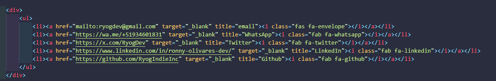

# 📘 Diario del Desarrollador | Developer's Diary

🔗 [🌐 Ver Demo en vivo | Live Demo](https://ryogindieinc.github.io/diario-del-desarrollador/)

---

## 🤝 Contribuciones | Contributions

**ES:**  
Actualmente este proyecto es personal, pero si tienes ideas o sugerencias, ¡siéntete libre de abrir un issue o forkearlo!

**EN:**  
This is currently a personal project, but if you have ideas or suggestions, feel free to open an issue or fork it!

---

## 📑 Tabla de Contenido | Table of Contents

- [📘 Diario del Desarrollador | Developer's Diary](#-diario-del-desarrollador--developers-diary)
  - [🤝 Contribuciones | Contributions](#-contribuciones--contributions)
  - [📑 Tabla de Contenido | Table of Contents](#-tabla-de-contenido--table-of-contents)
  - [📘 Descripción | Description](#-descripción--description)
  - [🧠 Contenidos | Contents](#-contenidos--contents)
  - [📌 Objetivo | Objective](#-objetivo--objective)
  - [🛠️ Tecnologías | Tech Stack](#️-tecnologías--tech-stack)
  - [🖼️ Captura | Screenshot](#️-captura--screenshot)
  - [🗂️ Estructura | Structure](#️-estructura--structure)
  - [📫 Contacto | Contact](#-contacto--contact)
  - [⚡ Frase motivadora | Motivation Quote](#-frase-motivadora--motivation-quote)
  - [📅 Última actualización | Last update](#-última-actualización--last-update)
  - [📄 Licencia | License](#-licencia--license)

---

## 📘 Descripción | Description

**ES:**  
Este proyecto documenta mi camino como desarrollador full-stack desde cero. Combina aprendizaje práctico, mini proyectos y reflexiones personales para formar un diario interactivo que también funciona como portafolio.

**EN:**  
This project documents my journey as a full-stack developer from scratch. It combines hands-on learning, mini projects, and personal reflections to create an interactive diary that also works as a portfolio.

---

## 🧠 Contenidos | Contents

- ✅ **HTML semántico** | Semantic HTML  
- ✅ **Accesibilidad básica** | Basic Accessibility  
- ✅ **SEO básico** | Basic SEO  
- ✅ **Formulario accesible** | Accessible Form  
- ✅ **Enlaces sociales con íconos** | Social Links with Icons  
- ✅ **Uso de Git & GitHub** | Git & GitHub usage  
- ✅ **Mini proyectos documentados** | Documented Mini Projects  
- 🛠️ **Proyecto en evolución constante** | Constantly evolving project  

---

## 📌 Objetivo | Objective

**ES:**  
Crear un diario interactivo y personal donde registre mi proceso de aprendizaje como desarrollador web, mostrando cada habilidad adquirida y aplicándola en tiempo real.

**EN:**  
To create an interactive and personal diary that documents my learning process as a web developer, showcasing each acquired skill and applying them in real-time.

---

## 🛠️ Tecnologías | Tech Stack

- HTML5  
- Font Awesome (íconos / icons)  
- Git & GitHub  

---

## 🖼️ Captura | Screenshot

---

## 🗂️ Estructura | Structure

/diario-del-desarrollador
│
├── index.html
├── /img
│ ├── LogoRyogDev.png
│ └── div-contato.png
├── README.md
└── ...

---

## 📫 Contacto | Contact

- 📧 Email: [ryogdev@gmail.com](mailto:ryogdev@gmail.com)  
- 📱 WhatsApp: [+51 934 601 831](https://wa.me/+51934601831)  
- 🐦 Twitter: [@RyogDev](https://x.com/RyogDev)  
- 💼 LinkedIn: [Ronny Olivares](https://www.linkedin.com/in/ronny-olivares-dev/)  
- 💻 GitHub: [RyogIndieInc](https://github.com/RyogIndieInc)

---

## ⚡ Frase motivadora | Motivation Quote

> *"No vine a jugar su juego monopoly, vine a cambiar las reglas."* — RyogDev

---

## 📅 Última actualización | Last update

`4 de agosto de 2025`

---

## 📄 Licencia | License

Este proyecto está bajo la Licencia MIT.  
This project is licensed under the MIT License.